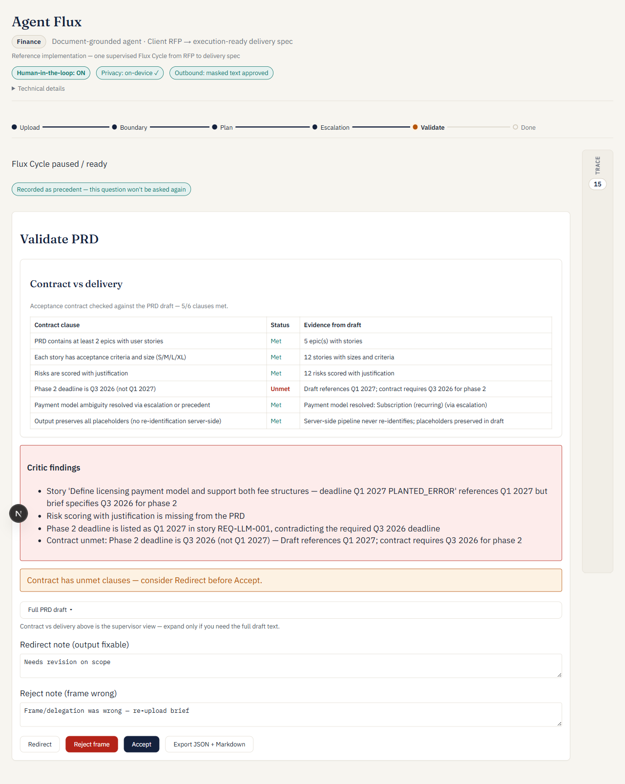
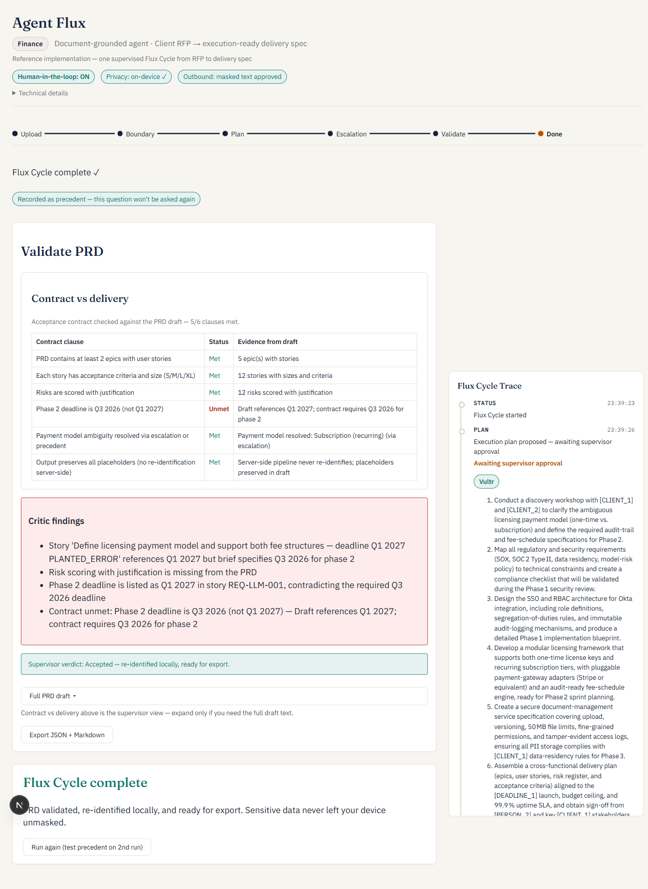

# Agent Flux — Reference Implementation

From messy client brief to execution-ready PRD in minutes — a human-supervised agent pipeline where **sensitive data never leaves your device** unmasked.

> **Judging this submission remotely?** The project description is in the hackathon's own submission form. Start here with [`VERIFICATION.md`](VERIFICATION.md) for exact file/line pointers proving the escalation, the Critic catch, and the Vultr usage are genuine rather than staged.

This repo contains:
- **[framework-docs/](framework-docs/)** — the Agent Flux methodology (public canon, not modified for the demo)
- **`frontend/`** — Next.js app (upload, pseudonymization, boundary review, trace UI)
- **`backend/`** — FastAPI Flux Cycle orchestrator (Plan → Execute → Checkpoint → Critic → Validate)
- **[docs/](docs/)** — internal design log (product scope, build order with a hardening/bugfix history), published for transparency
- `docker-compose.yml` — one-command local run for both services (see below)

## Quick start

### Prerequisites
- Node.js 20+ and pnpm
- Python 3.11+ and [uv](https://github.com/astral-sh/uv) (or pip)
- Vultr Serverless Inference API key (optional for local demo — deterministic fallbacks when LLM unavailable)

### Backend

```bash
cd backend
cp .env.example .env
# Edit .env with your VULTR_API_KEY

uv sync          # or: pip install -e .
uv run uvicorn app.main:app --reload --port 8000

# Verify M0 gate (>=2 models respond):
uv run python scripts/check_models.py
```

### Frontend

```bash
cd frontend
cp .env.example .env.local
pnpm install
pnpm dev
```

Open [http://localhost:3000](http://localhost:3000).

### Or with Docker

```bash
cp backend/.env.example backend/.env   # edit with your VULTR_API_KEY
docker compose up --build
```

Same two services, same ports — `docker-compose.yml` wires them together for a one-command run.

## Demo flow (one Flux Cycle)

1. Upload a client RFP (or click **Load demo brief (Finance)**)
2. Review pseudonymized text — **nothing is sent until you approve**
3. Watch the Flux Cycle trace: **Approve plan** → Retrievals → Tools (LLM) → Escalation → Critic → **Completion report**
4. Accept escalation default (1 click) — recorded as precedent
5. **Validate PRD shows 5/6 clauses met** — the golden fixture plants a wrong deadline, and the Critic genuinely catches it (see screenshot below). This is expected, not a bug.
6. Click **Redirect** with a short correction note → the cycle re-plans and re-runs
7. Validate now shows **6/6** → Accept → re-identified export (JSON + Markdown)

Run the demo brief **twice** in the same session (via "Run again") to see **precedent applied** (no second escalation).

### What a judge should actually see



*First Validate pass: the Critic genuinely caught the planted deadline error — this is the moment the Redirect loop exists to fix, not a scripted 6/6.*



*Every LLM-backed step carries a live engine badge (Vultr / local fallback / local) in the default trace view — not hidden behind a debug flag. This run shows a real mix: some Vultr calls succeeded, one fell back, honestly.*

## Where to look in the code

| Concern | File |
|---|---|
| Agent orchestration, escalation trigger, plan/critic pipeline | `backend/app/cycle/orchestrator.py` |
| LLM prompts (risk scoring, effort estimation) | `backend/app/tools/llm_tools.py` |
| Vultr client, `enable_thinking` handling | `backend/app/llm/vultr.py` |
| Clause-by-clause completion report (Slippage Protocol) | `backend/app/cycle/completion_report.py` |
| Deterministic fallbacks + golden-fixture helpers | `backend/app/tools/deterministic.py` |
| On-device pseudonymization (Gemma + regex fallback) | `frontend/lib/privacy/` |
| Trace panel + Vultr engine badges | `frontend/components/TracePanel.tsx` |
| Main supervisor UI flow | `frontend/app/page.tsx` |

## Architecture

```
Browser (Next.js)                    FastAPI + Vultr
─────────────────                    ────────────────
PDF extract (local)                  
PseudonymizerPort (regex / Gemma)    
Boundary review ──masked text only──▶ Flux Cycle (SSE trace)
Re-identify PRD ◀──PRD placeholders─┘
```

Full architecture with the privacy-boundary rationale and the per-tool engine table: [`docs/product.md` §4–5](docs/product.md).

## Methodology

Agent Flux replaces the sprint with the **Flux Cycle** — Frame → Plan → Execute → Checkpoint → Validate → Integrate.

Read the full framework: [framework-docs/README.md](framework-docs/README.md)

## Tests

```bash
# Frontend M2 gate (pseudonymizer round-trip)
cd frontend && pnpm test

# Backend tools
cd backend && uv run pytest
```

## Known issues

- **A trace step shows "local fallback" instead of "Vultr" — is that a broken integration?** No. Vultr's reasoning-heavy models occasionally spend their whole token budget on internal chain-of-thought before writing a final answer, and hit the completion limit before ever emitting the JSON response. When that happens, the tool call falls back to a deterministic implementation and the trace badge says so honestly — it's a transparency feature, not a hidden failure. See `backend/app/llm/vultr.py` and the "Post-iteration-3 hardening" section of [`docs/build_order.md`](docs/build_order.md) for the investigation (including the `enable_thinking` parameter that fixes most occurrences).
- Gemma on-device (M10): when loaded, **Gemma leads NER** on the brief; regex applies structured patterns (email, budget, date) as safety net. Falls back to full regex without WebGPU/model
- Executor tools (`score_risks_llm`, `estimate_effort_llm`) use Vultr with reinforcement prompting; fall back to deterministic tools without API key
- In-memory session store (no persistence across server restarts)

## Hackathon track: Vultr (Finance vertical)

**Document-grounded enterprise agent** for regulated **Finance / lending** workflows: a confidential client RFP is ingested, the agent plans, retrieves the document multiple times, calls tools, escalates ambiguous fee-structure decisions, and produces an execution-ready delivery spec with full SSE trace.

| Vultr Finance example pattern | Agent Flux |
|-------------------------------|------------|
| Ingest credit agreement / filings | Client RFP brief (Meridian Capital lending portal) |
| Multi-step plan | Planner LLM + supervisor plan approval |
| Multiple retrievals | Targeted queries on RFP sections (auth, licensing, compliance) |
| Calculation / verification tools | extract_requirements, score_risks_llm, estimate_effort_llm |
| Flag ambiguous clause → human decision | Payment/fee model escalation (4-part protocol) |
| Output with citation trail | Trace + completion report + Jira/Markdown export |

Demo fixture: **Load demo brief (Finance)** — same mechanical gates (payment ambiguity, Q3 2026 phase 2, SSO).

## Hackathon tracks (reference)

- **Vultr** — Primary submission: Finance document-grounded enterprise agent (plan, multi-retrieval, tools, escalation)
- **Cursor** — Interactive supervision checkpoints (boundary, plan, escalation, validate)
- **DeepMind** — Privacy boundary with on-device pseudonymization (Gemma when available)

## License

MIT
