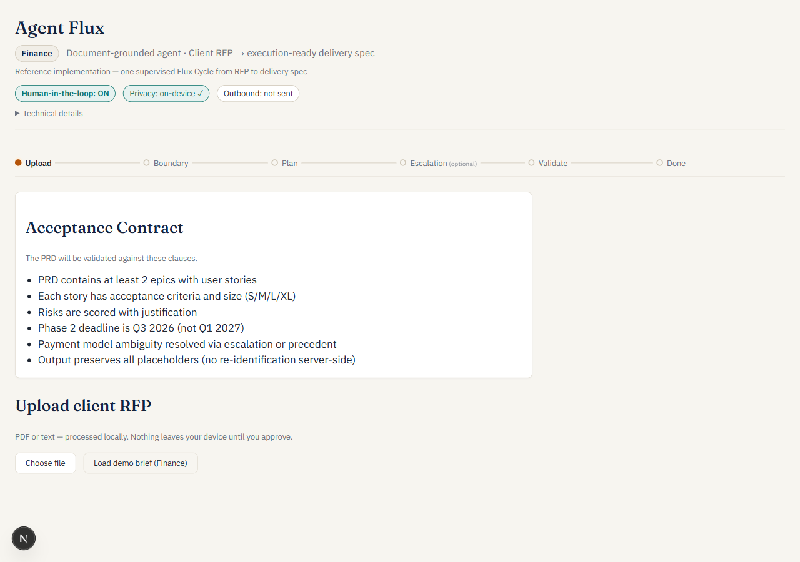
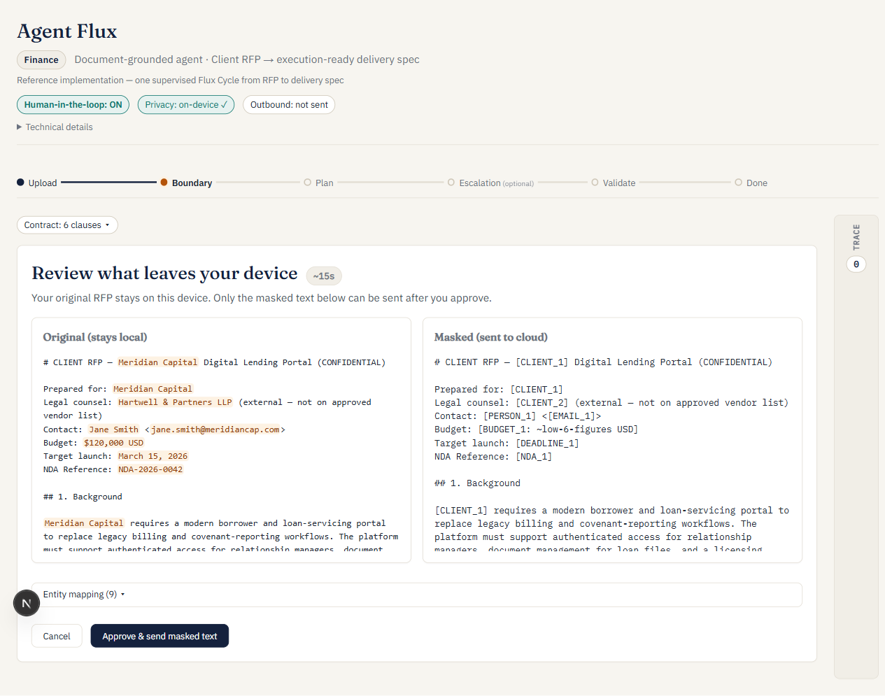
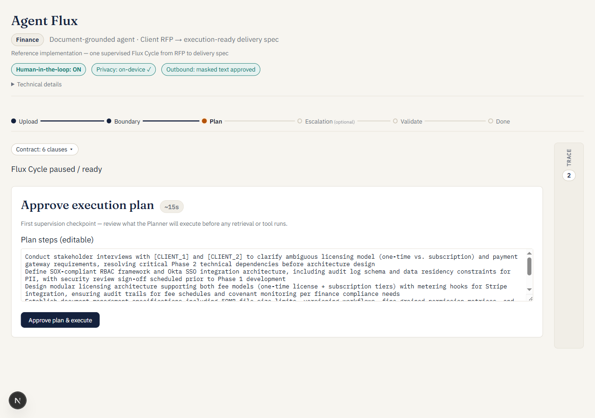
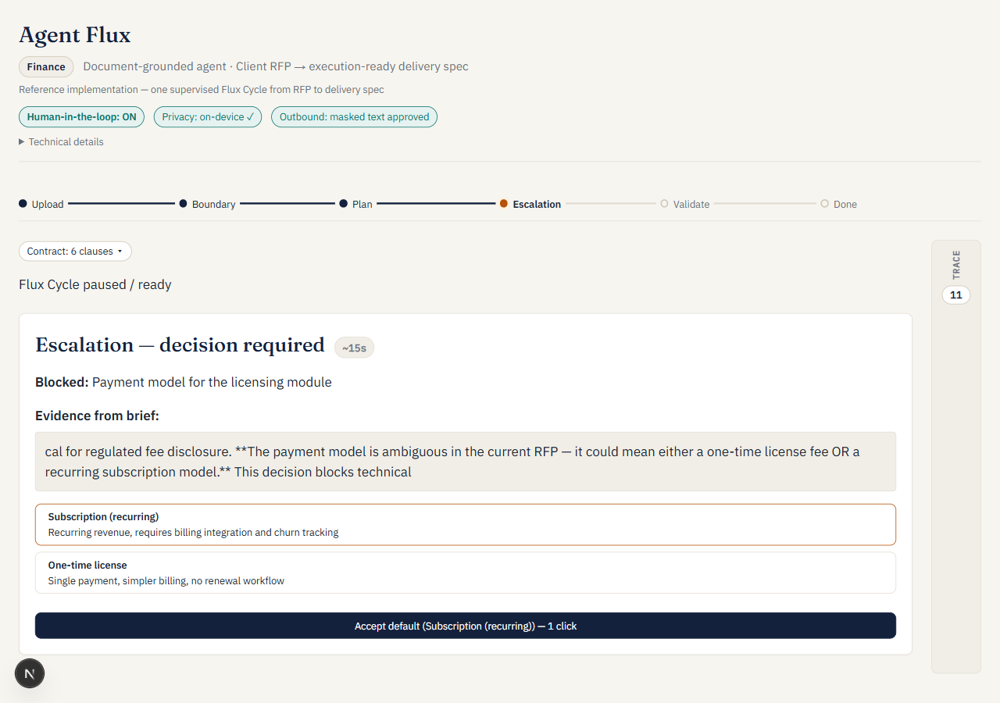
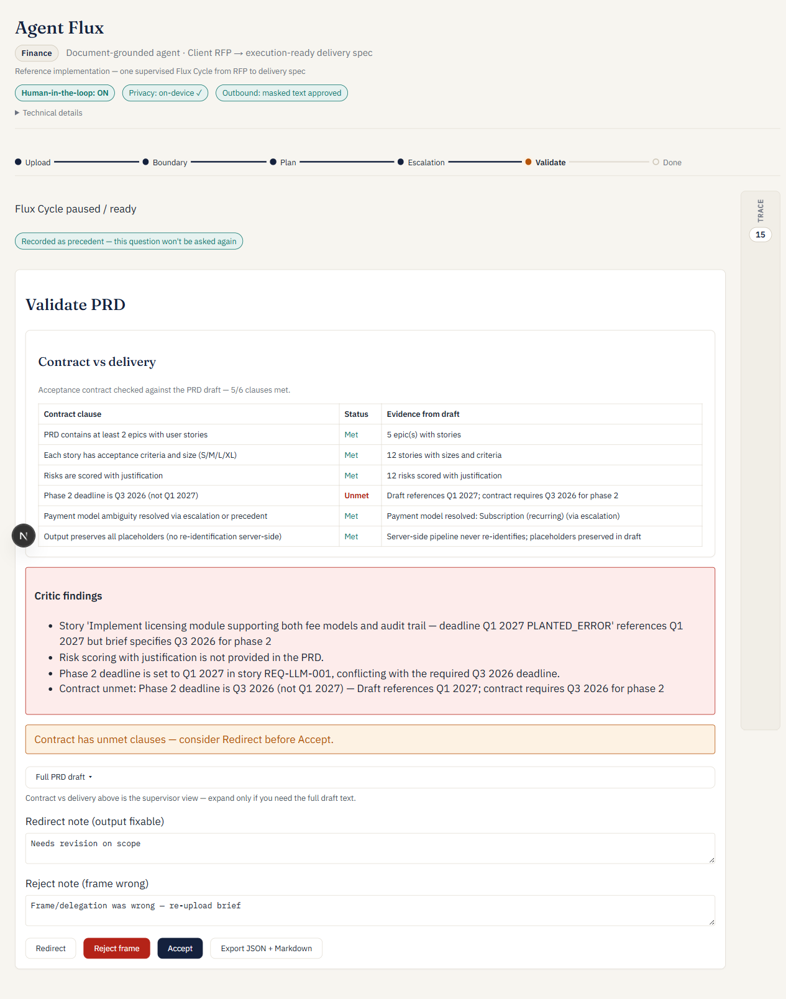
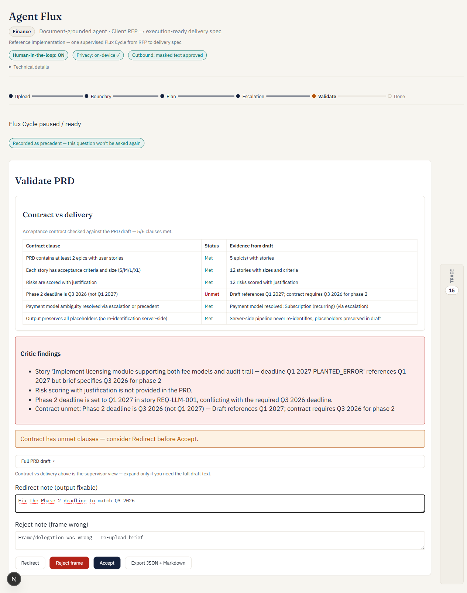
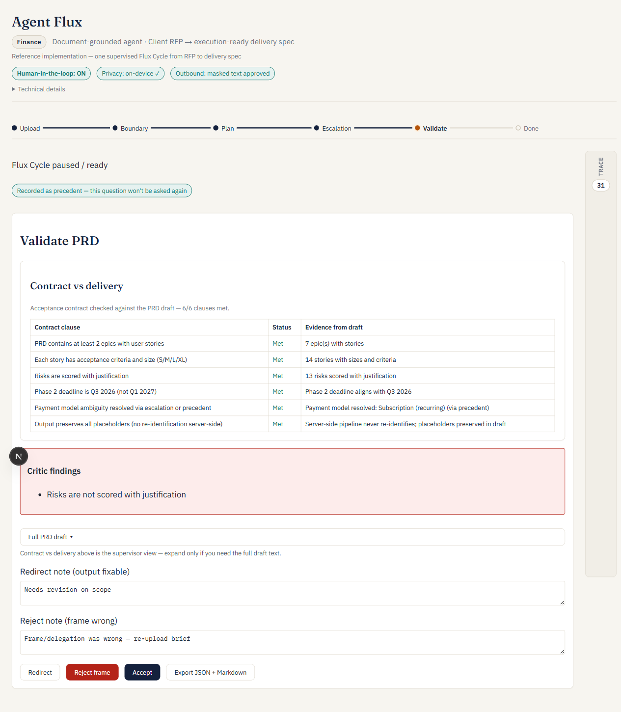
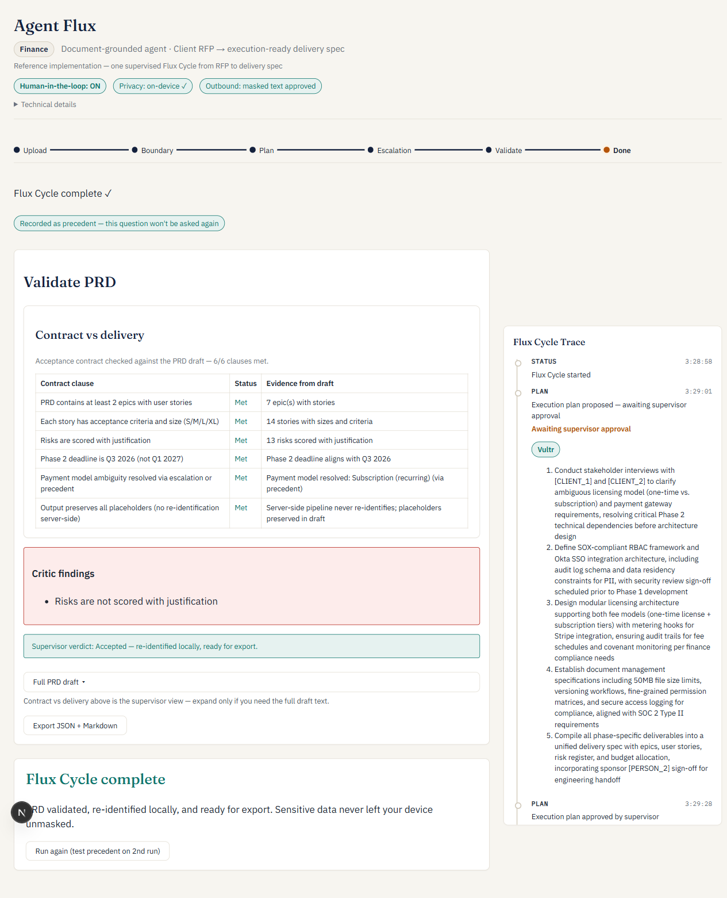

# Visual walkthrough — one supervised Flux Cycle

Eight screenshots, one per phase, taken end to end in a single run. This exists so a judge can follow the full cycle without depending on the edited 1-minute video (which necessarily cuts real waiting time) or on re-running the app locally. Each phase links back to the code that produces it — see [`VERIFICATION.md`](VERIFICATION.md) for exact file/line proof if you want to check any of these claims yourself.

---

## 1. Upload

The initial screen shows the **Acceptance Contract** up front — the 6 clauses the final PRD will be validated against — before a single document is uploaded. This is the Frame stage: the supervisor knows what "done" means before the agent does anything.

## 2. Boundary review

Original text (left) vs. pseudonymized text (right), side by side. Real entities — client name, law firm, budget, dates — are only visible on the left; the right side is what would actually leave the device, with typed placeholders (`[CLIENT_1]`, `[BUDGET_1]`, etc.). Nothing is sent until **Approve & send masked text** is clicked. This is the literal implementation of the framework's privacy boundary, not a diagram.

## 3. Plan approval

The Planner proposes its execution plan — an editable list of steps — before any retrieval or tool call runs. The **Vultr** badge next to the plan confirms this specific plan was generated by the LLM, not the deterministic fallback. First human checkpoint: approve or edit before execution starts.

## 4. Escalation

Mid-execution, the cycle pauses on a genuinely ambiguous decision — the brief never states whether the licensing fee is one-time or recurring. The 4-part escalation format (blocked decision, evidence quoted from the brief, options with implications, a pre-selected default) lets the supervisor resolve it in one click. This is dual-triggered: a regex match on the brief text, or the LLM's own `triggers_escalation` risk signal — either is enough (see `VERIFICATION.md`, claim 1).

## 5. Validate — first pass, 5/6

**This is the most important screenshot in this walkthrough.** The golden demo fixture deliberately plants a wrong Phase 2 deadline (Q1 2027 instead of the contract's Q3 2026) so there's something concrete for the Critic to genuinely catch — not scripted, not auto-corrected before anyone sees it. The completion report shows **5/6 clauses met**, the deadline clause is marked `Unmet` with real evidence, and the Critic findings name the exact story and mismatch. The amber banner suggests a Redirect. If this showed 6/6 on the first pass, the Critic wouldn't be proving anything — 5/6 here is the point, not a bug (see `VERIFICATION.md`, claim 2).

## 6. Redirect

The supervisor writes a short correction — *"Fix the Phase 2 deadline to match Q3 2026"* — and clicks **Redirect**. This isn't a retry: the note is injected into the next planning pass as a `REQ-SUPERVISOR` requirement and the cycle genuinely re-plans and re-executes with it, revision 2.

## 7. Validate — second pass, 6/6

Only after the redirect loop does the deadline clause flip to `Met`. Note also **"via precedent"** on the payment-model row: the escalation from phase 4 was answered once and didn't need to be asked again on this second pass — recorded as a session precedent, applied automatically.

## 8. Done — full trace + export

The full trace of both passes, with an engine badge on every LLM-backed step. Two badge types matter here, and they mean different things:
- **`local`** — this step is deterministic *by design* (e.g. `extract_requirements`, a regex baseline) and never calls Vultr at all. Not a fallback, just not an LLM step.
- **`Vultr`** — this step's LLM call to Vultr Serverless Inference succeeded. In this run, every LLM-backed tool call succeeded on Vultr, including `score_risks_llm` on both passes (see `VERIFICATION.md`'s note on why this specific call sometimes falls back on a large batch, and how it's mitigated).

The Critic badge also shows the actual model name — `nvidia/Nemotron-3-Nano-Omni-30B-A3B-Reasoning-BF16` — confirming which NVIDIA model reviewed the draft, not just that "an LLM" did. Export produces `prd.md` and `prd-jira.json`, both correctly named (not extension-less UUIDs — see `VERIFICATION.md` for why that used to be a real bug and how it's fixed).

---

*All 8 screenshots were captured in one continuous run against the code on `main`, via Playwright MCP — the same tool used throughout this project's development to verify behavior end to end.*
